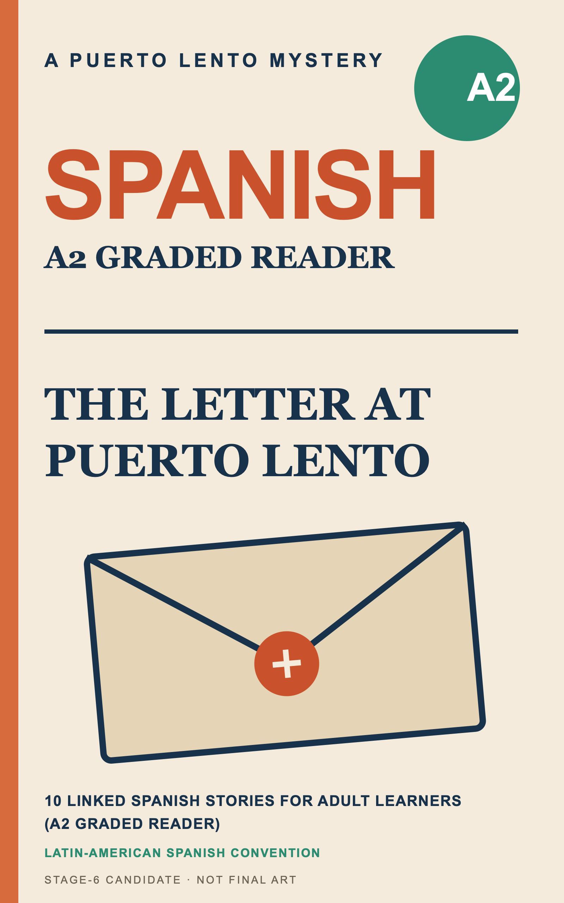
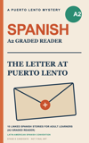
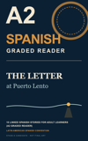
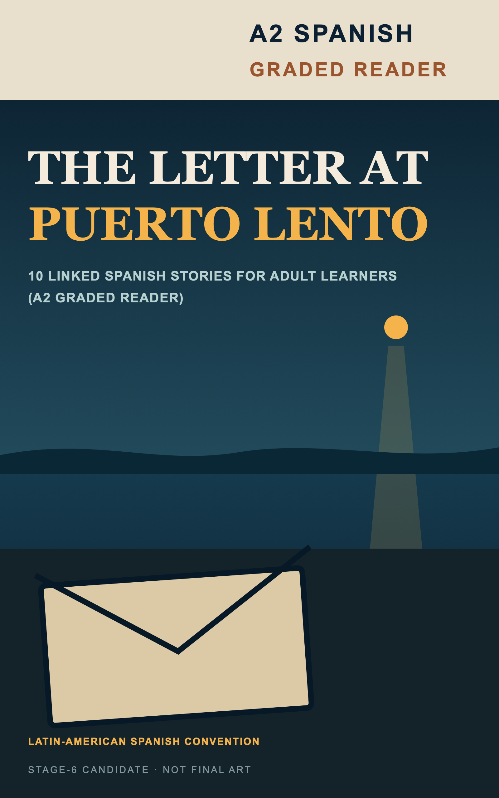

# Cover direction — Stage 6 visual approval brief

**Status:** Concept 1 selected; human-generated background 02 selected and composited into a refined 1600×2560 front-cover candidate; no print spread exists.  
**Selected mark direction:** T1, *The Letter at Puerto Lento*. The KDP description is locked. `Avery Calder` was rejected after both final reviewers found an active-author collision. The owner approved the exact pen name `Nina Marlo` on 2026-08-15; the fresh practical exact-name screen found no active author collision in accessible results.

## Evidence used

The dated scan is `research/cover-comps.md`. Amazon product pages were unavailable behind “Continue shopping” interstitials and were not bypassed. Two indie covers were observed through public Goodreads assets; the Olly Richards cover was observed through the Teach Yourself publisher asset.

Observed—not inferred—shelf rules:

1. `SPANISH` and/or `SHORT STORIES` are oversized on all three covers and survive around 100px.
2. Beginner/adult qualifiers, promises, author names, and illustration details weaken or disappear first.
3. Contrast is consistent, but palette is not: cream/orange, purple/yellow, and orange/multicolor all occur.
4. Typography—not one shared imagery convention—carries category recognition.
5. A fiction-style title needs an explicit, prominent `A2 SPANISH GRADED READER` signal.

## Shared requirements

- Adult Spanish-learning fiction, not a child primer, phrasebook, travel guide, or grammar workbook.
- Title/subtitle/series/author text remains editable and must match approved metadata.
- Per `research/gtm-series-decision.md`, the initial reader-facing cover is standalone and unnumbered: no `Volume 1`, `Book 1`, `Level 2`, or `A1–A2` badge. `A2 Spanish Graded Reader` remains the level/category signal.
- No claim of audio, available English translation, CEFR certification, native authorship, or region-wide authenticity.
- The Stage-0 differentiation contract requires the declared Latin-American convention on the cover. Every comp includes the bounded line `Latin-American Spanish Convention`; it does not claim native or region-wide authenticity.
- Every approval comp renders the exact T1 candidate subtitle, `10 Linked Spanish Stories for Adult Learners (A2 Graded Reader)`, and the bounded line `Latin-American Spanish Convention`. Supporting text need not remain readable at 100px, but it must work at full size and match the selected metadata before final export.
- Final eBook cover will require KDP-specific dimension/file validation. These 1600×2560 PNGs are visual comps, not upload-ready approval.
- Print spine/back construction waits for final trim, paper, page count, barcode, and an interior lawfully unblocked from `PIPE-001`.

## ADR-005 sub-decision

**Direction: hybrid composition.** Use deterministic, editable typography over either generated background imagery or generated texture. Never ask an image model to render words.

| Criterion | Baked-in AI text | Hybrid background + editable type | Decision |
|---|---|---|---|
| 100px category/title legibility | Unreliable and difficult to correct | Can be measured and revised | Hybrid |
| Metadata changes | Requires regeneration | Text layers remain editable | Hybrid |
| Series consistency | Hard to reproduce | Shared grid/type system is repeatable | Hybrid |
| Disclosure | Generated image must be logged | Generated background/texture must still be logged | No disclosure advantage; hybrid wins on control |
| Cost | Unknown retries | One clean background/texture plus deterministic overlays | Hybrid expected to cost less; actual provider/rate still unselected |

The SVG/PNG files in `exports/cover/concepts/` are AI-authored deterministic approval comps. The refined candidate is under `exports/cover/final/` and embeds the owner-selected `assets/cover-background-02.jpeg` beneath editable SVG typography. The owner supplied two generated JPEG backgrounds, but provider, model, and actual cost have not yet been supplied; those fields remain an explicit compliance blocker and must not be guessed. Both source JPEGs are 816×1312, so the target-size composite carries a source-resolution caveat.

## Concept 1 — Category-first literary bridge





**Hypothesis:** conform to the shelf’s type hierarchy first, then differentiate with restrained editorial color and the letter motif.

- **Visual system:** warm cream, rust-orange category word, navy serif title, green A2 badge, simple envelope/seal.
- **Observed 100px result:** `SPANISH`, `A2`, `GRADED READER`, and the two-line narrative title remain identifiable. The exact subtitle and locale-convention line are present and workable at full size but do not reliably read at thumbnail size.
- **Strength:** best current balance of category recognition and narrative identity.
- **Risk:** closest to the incumbent’s cream/category-first hierarchy; final art must avoid the comp’s child-adjacent illustration style.
- **Final-background option:** subtle generated paper/counter texture or restrained editorial envelope still life, with all text overlaid afterward.
- **Background-only prompt:**

  > Sophisticated editorial book-cover background for an adult literary mystery and Spanish graded reader, warm cream tactile paper with a restrained weathered envelope and subtle postal seal, mature minimal composition, generous clean negative space for large typography, no people, no dog, no classroom objects, no flags, no travel-poster motifs, no text, no letters, no logo, no watermark, vertical 1:1.6 composition, 1600×2560 target.

- **Alt-text draft:** “Cream cover with large orange Spanish lettering, a green A2 badge, the title The Letter at Puerto Lento, and a simple sealed envelope.”

## Concept 2 — Typographic series system




**Hypothesis:** make level and category unmistakable while creating a repeatable A2→B1 series architecture.

- **Visual system:** deep navy field, oversized cream A2, amber `SPANISH`, cream category line, postal-ring and one-light motif.
- **Observed 100px result:** `A2`, `SPANISH`, and `GRADED READER` are strongest of the three. `THE LETTER` survives; `at Puerto Lento`, the exact subtitle, and the locale-convention line are present at full size but do not reliably read.
- **Strength:** lowest category-confusion risk and easiest series repetition.
- **Risk:** can feel instructional rather than fictional; the title and quiet postal/horizon motif must retain story character.
- **Final-background option:** generated tactile paper/ink texture only; composition and typography remain deterministic.
- **Texture-only prompt:**

  > Abstract tactile paper and ink texture for a sophisticated adult mystery cover, deep midnight navy with restrained worn-cream fibers, one muted amber postal-ring impression and a barely visible sea-horizon grain, abundant clear space for typography, no text, no logos, no people, no classroom imagery, no watermark, vertical 1:1.6 composition, 1600×2560 target.

- **Alt-text draft:** “Deep navy typographic cover with large A2 and Spanish graded reader text, an amber postal ring, and a small light on a horizon.”

## Concept 3 — Fiction-first coastal mystery




**Hypothesis:** lead with adult-fiction atmosphere while protecting category recognition through a separate high-contrast band.

- **Visual system:** night harbor, cream category band, large cream/amber narrative title, single harbor light, envelope on a dark counter.
- **Observed 100px result:** the narrative title and letter/light scene survive. After one repair cycle, the two-line `A2 SPANISH / GRADED READER` band is identifiable, though still weaker than Concepts 1–2. The exact subtitle and locale-convention line are present at full size but do not reliably read.
- **Strength:** strongest adult-mystery differentiation and closest to the manuscript’s tone.
- **Risk:** highest chance of being read as ordinary fiction rather than a learning product; a detailed generated scene could destroy the clean category band.
- **Final-background option:** generated harbor/kiosk scene with strict negative-space and contrast constraints; typography remains overlaid.
- **Background-only prompt:**

  > Adult literary coastal mystery at night in a small fictional Latin American harbor town, an unsealed weathered envelope on a simple dark kiosk counter in the foreground, one distant amber harbor lamp reflected in deep blue water, restrained editorial realism, sophisticated quiet mood, preserve an uncluttered pale band across the top and broad dark negative space for typography, no people, no flags, no maps, no tourist landmark, no cartoon style, no classroom objects, no text, no logos, no watermark, vertical 1:1.6 composition, 1600×2560 target.

- **Alt-text draft:** “Dark blue coastal-night cover with a letter on a counter, one amber harbor light, and the title The Letter at Puerto Lento beneath an A2 Spanish graded reader band.”

## Visual comparison

| Concept | Category at 100px | Narrative title at 100px | Differentiation | Main risk | Current recommendation |
|---|---|---|---|---|---|
| 1 — Category-first | Strong | Strong | Moderate-high | Too close to cream instructional shelf if final art becomes cute | **Recommended balance** |
| 2 — Typographic series | Strongest | Partial | High as a repeatable series system | May feel instructional | Recommended if series clarity is the priority |
| 3 — Fiction-first | Adequate after repair | Strongest | Strongest adult-fiction signal | Category confusion/detail collapse | Recommended if mystery positioning is the priority |

The recommendation is based on the rendered comps above, not predicted grades. It is still a human judgment gate, not conversion proof.

## Human visual micro-gate

**Selected 2026-08-14: Concept 1 — Category-first literary bridge, using background 02.**

The final Luna/Terra panel split on background choice: Luna selected 02; Terra selected 01. The human owner's explicit preference for 02 is the ruling. The initial cover is standalone and unnumbered; the KDP series field and bespoke imprint remain `none` per `research/gtm-series-decision.md`. This does **not** authorize publication, produce final print geometry, or resolve `PIPE-001`.

## Refined front-cover candidate

Artifacts:

- `exports/cover/final/front-cover.svg` — self-contained SVG with embedded background and editable typography.
- `exports/cover/final/front-cover.png` — 1600×2560 review render.
- `exports/cover/final/front-cover.jpeg` — 1600×2560 high-quality JPEG candidate.
- `exports/cover/final/front-cover-100.png` — actual 100×160 thumbnail.

Observed result:

- `SPANISH`, `A2`, `GRADED READER`, and the two-line title survive at 100px.
- The envelope reads as adult editorial imagery rather than the approval comp's clip-art mark.
- Supporting subtitle, locale line, and byline remain full-size information, as intended.
- Internal candidate text, unapproved mystery strapline, series labels, and volume labels are absent.
- The byline is the owner-approved exact pen name `Nina Marlo`.

Remaining before final front-cover approval:

1. Human supplies the background-generation provider, model, and actual cost for compliance logging.
2. Human accepts the 816×1312 source-resolution caveat or supplies a native higher-resolution background 02.
3. Build the spine/back only after the bilingual interior, trim, paper, page count, and barcode are validly known.

## Title restyle — 2026-08-14 (owner instruction)

Owner instruction, verbatim: *"the style of (the letter at puerto lento) must be adjsted, inspired from the stories."*

The old title was one Palatino block: italic line over roman caps, differing only in slope. That is a type
default, not a reading of the book. The restyle takes both halves from the manuscript:

- **"The Letter at"** — Snell Roundhand script, 150px. The object that starts and ends all ten stories is a
  handwritten letter nobody claims. The line is ink on paper.
- **"PUERTO LENTO"** — Didot bold caps, 152px, letter-spacing 5. The town is fixed, slow, and does not change;
  engraved harbour signage, not handwriting.

Measured on the 1600×2560 `sips` render (navy `#173753`, tolerance <90):

| Line | x extent | y band |
|---|---|---|
| script | 144–1046 | 563–701 |
| caps | 131–1451 | 751–863 |

Caps now stop at x=1451, inside the category rule (`x2=1474`); the first cut at 158px/ls7 ran to x=1524 and
left a 76px right margin against a 126px left one. The two lines have a 49px blank band between them.

Known and accepted: the script line loses legibility at the 100×160 thumbnail. That is deliberate —
`PUERTO LENTO` is the load-bearing half of the thumbnail and stays heavy serif caps, which it survives as.

Re-rendered finals (all from the edited SVG, `sips`; `qlmanage -t` cannot render a 1:1.6 cover — it clips
height to the `-s` value):

```
6a5f6acc5e3025daeb223b9061754df8817151ca168c742aa63c3012d7bb2def  front-cover.svg
ec6f67683a17c9f96056e80b814d7c102595f7f7c0a9562499c73e051f1a7853  front-cover.png
6a75f6b496f5cc091ff43811a11afedfc0199f0f6fca39c7550da54e91f798a4  front-cover.jpeg
88a7fa5d601334d33f94ab97ee4e8d1f2b10d71e84187eccc97fd6844c7a3831  front-cover-100.png
```

The remaining production requirements above are unchanged by this restyle. The byline was subsequently
approved as `Nina Marlo` on 2026-08-15 and the current finals were re-rendered with that exact spelling.

## Paperback wrap — 2026-08-15

The owner approved paperback, 5×8 in (127×203.2 mm), black ink, cream paper, left-to-right,
no interior bleed, and a text-free spine. The final 81-page interior produces KDP's 82-page
production count and a 5.207 mm cream-paper spine. The exact full-bleed wrap is therefore
265.557×209.55 mm.

`print-wrap.pdf` is one page containing the back, blank spine, and approved front. The back uses
the literary hook “A letter no one will claim. A town that will not explain.”, a concise reader
description, four factual feature lines, a call to action, and the approved `Nina Marlo` byline.
A blank 2×1.2 in field is reserved for KDP's barcode. No template guides, crop marks, placeholder
text, spine text, or reader-facing AI disclosure are exported.

Structural inspection confirmed one 752.760×594 pt page, embedded fonts, and the 1600×2560 front
image. Rendered inspection of `print-wrap-preview.png` confirmed safe-area placement, the narrow
blank spine, barcode reservation, back-cover hierarchy, and front-cover match.

```text
27a022ca0d0e10a0eed5973ea4f14825f7af96c9cec1ea1e85f5f5c2387419e3  print-wrap.pdf
a87849b6cfd16cc776e993b560080825b9fb5d959efa16e38cb06b7039ac481e  print-wrap-preview.png
```

This is a geometrically complete review wrap, not yet an upload-ready release asset. Background 02
is only 816×1312 at native resolution and its provider/model/cost provenance is incomplete. Gate E
remains blocked until a native ≥300-DPI replacement and provenance record exist.

## Owner-supplied back background and KDP template — 2026-08-15

The owner added `assets/cover-background-02-back.jpeg` and the calculator package
`assets/PAPERBACK_5.000x8.000_82_BW_CREAM_en_US`. The 816×1312 back image has almost exactly the
same aspect ratio as the full back panel including bleed, so it now fills x=0–130.175 mm and the
full 209.55 mm height without distortion. Back copy moved into its cream field; the compact feature
list sits over the dark harbor field. The official 50.8×30.48 mm barcode rectangle remains blank at
x=73.025–123.825 mm, y=169.545–200.025 mm.

The downloaded template PDF's production drawing is 752.760×594 pt, matching the generated wrap.
Its fold lines are x=130.175 mm and x=135.382 mm, matching the 5.207 mm blank spine exactly. Its
barcode drawing matches the reserved rectangle exactly. The template layer is not present in the
exported cover.

```text
50c92a4830a03e604d90147fc9fb3ed5d217c1f0e8f2aaeeb1be5d3804495ce0  cover-background-02-back.jpeg
2f0c11e56ebe51f3bd9a5bb2e164edc2bccce6b1da58512e00ec021db6ecd899  KDP template PDF
4f77c2cb337f8f02d5630bbef076b575ab80b5d9387881d71962d27f20bd71dd  print-wrap.pdf
57f806571af452a642b8af08907f751be8b51c1894642ad5dc50b67f340ef9cb  print-wrap-preview.png
```

At full placed size the new back source is approximately 159 DPI, so it does not close the existing
native-resolution blocker. The creation provider/model/cost also remains to be recorded.

## Back-panel correction and Canva handoff — 2026-08-15

Owner review caught an unintended dark outline around the lower back-cover field and an ambiguous
spine transition. The outline came from a filled PDF rectangle retaining a stroke color. All filled
back-cover rectangles now have no stroke. The former fold-blending overlays were removed and the
official template's exact x=130.175–135.382 mm interval is now a solid navy, text-free 5.207 mm
spine.

For manual Canva assembly, the back panel was also exported separately from the full wrap. It is
130.175×209.55 mm, includes the outside bleed, and ends exactly at the back/spine fold. The PNG is
1538×2475 pixels at a 300-DPI export scale; this does not increase the native detail of the
816×1312 owner-supplied background.

```text
a8e2768544731506442a24989b20c959b1c108d2fac3c6aba1fa76a4f7c16a91  print-wrap.pdf
baccbffa427733e3ead75d88217b00f3c2c268343873b89d5cfe3a2ad2b77609  print-wrap-preview.png
065352d000886e8d07b25af143d9c3acf1394485ca6d2abe220a27a44838dd24  back-cover-canva.pdf
beffbc2fcc225e9a50308dcd0f4905072833465e7665bac87aa61155ce0734e7  back-cover-canva-300dpi.png
4ee012b9d01b571c858c2516a8cf38358cd4c9ed6b2b1e3cb66a2063254e5db7  front-cover-canva.pdf
0ff17f5eed2651ee34625218fbc8063d62ca7777fa8eb4211a977e746af5a76f  front-cover-canva-300dpi.png
```

## Manual-barcode handoff — 2026-08-15

On owner instruction, the visible cream barcode reservation was removed from the SVG and PDF
renderer. The harbor artwork now continues uninterrupted through the lower-right back cover in the
full wrap and Canva back panel. For manual Canva placement, the official template's barcode region
is still x=73.025–123.825 mm and y=169.545–200.025 mm within the 130.175×209.55 mm back panel; those
coordinates are guidance only and are not drawn in any exported artwork.

```text
1992b9366afe05c737a0ffc6204d00f267b7a41729f98fe70130449f3fca9c36  print-wrap.pdf
f9c78618869b8852d8d733c9517dbbca5de5d81a24a50a5cba81ed0f36bdfd0b  print-wrap-preview.png
28a378f01f73624d9b61bc94d35afb7db06f0dfcf2d75e0633b1d883c0d30095  back-cover-canva.pdf
ac83aba8f40ad550aee4176d73d507ab0ada0a522984e3ba7054c9440a6e9874  back-cover-canva-300dpi.png
029294e8d6b323b5ac5c613f74f1d0fef408370d1731bd0c5d6c78d1861f8d9d  front-cover-canva.pdf
0ff17f5eed2651ee34625218fbc8063d62ca7777fa8eb4211a977e746af5a76f  front-cover-canva-300dpi.png
```

## Continuous full-wrap master — 2026-08-16

The owner-selected second Nano Banana Pro candidate is now the single background for the entire
back + spine + front canvas. `print-wrap.svg` is the clean production master at exactly
265.56×209.55 mm. It contains no template layer, fold line, safe-area outline, or visible barcode
reservation. `print-wrap-guides.svg` is a separate review-only alignment copy and must never be
uploaded to KDP. The spine remains visually continuous and text-free.

The downloaded KDP template, rather than the calculator table's abbreviated label, governs live
content placement. Its white live rectangles are:

- back: x=6.35–127.00 mm, y=6.35–203.20 mm;
- front: x=138.557–259.207 mm, y=6.35–203.20 mm.

These are each 120.65×196.85 mm and sit 3.175 mm inside the trim edges. Background artwork extends
to every outer file edge through the bleed. The nominal spine safe area is only 2.03 mm wide, so no
spine lettering is used. The template's 50.8×30.48 mm barcode zone remains reserved in the back
layout but is not drawn. `front-cover.svg` uses the exact front-trim crop (127×203.2 mm) of the same
wrap, so the Kindle cover is no longer an independent composition.

The selected source is 1168×912 px, approximately 112 effective DPI over the complete wrap. The
300-DPI-sized export does not invent source detail; therefore the current PDF is for layout review,
not KDP upload. Regenerate or upscale the identical candidate to at least 3137×2475 px before the
final upload build.

```text
7d496f8936272c318ca9d1b5b4e69f5b8daca562202ae13af13fa9d595b47e8e  full-cover-background-02.jpeg
14585c75e03dc607e4e882f5eea599b0308b4b69723c72ba7a5ef590ffe306cc  print-wrap.svg
5aea267ec79d2461620869b9c81dc3532934186aa5f91b89cf642b345badce81  print-wrap.pdf
b4f9dda6ef0efcb77a2fef89adbed3b6375a8cd51db3cd622dce13f44a9fd237  front-cover.svg
```
